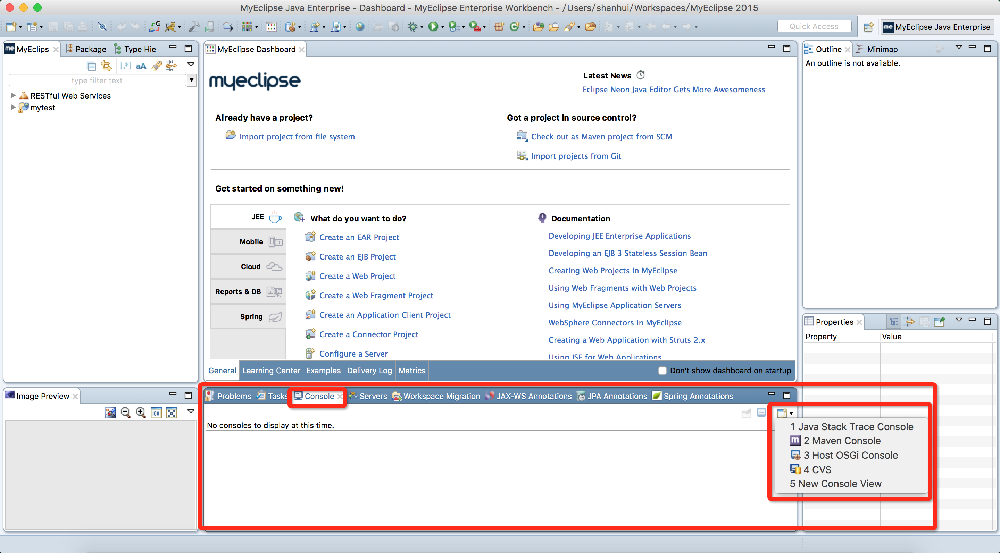

# 2016.06.26 JAVA培训

* 2016-6-26 10:02:54
* <shanhui@agora.io>

##1 页面

* 静态，例如说新闻页面
* 动态，例如说淘宝页面

##2 网络基本架构

* B/S

    * 优点：便于维护，实施

* C/S

    * 优点：界面更加丰富，更加安全，系统负载比较小

##3 开发工具

* MyEclipse
* Tomcat

##4 第一个页面

1. 打开MyEclipse
2. 创建Web Project工程，名字：myweb
3. 点击启动服务器
4. 点击部署服务器
5. 打开浏览器，输入地址访问页面，地址：

    ```
    http://localhost:8080/myweb
    ```

##5 可能存在的问题

###5.1 启动服务器时，没有打印输出log到控制台

选择控制台为__Java Stack Trace Console__即可。



###5.2 端口不能绑定，有两种方式

1. 第一种查看占用端口的进程，杀死进程
    打开控制台，输入以下代码：

    ``` sh
    # 查看端口占用
    netstat -ano | findstr 8080
    
    #TCP    0.0.0.0:8080    0.0.0.0:0   LISTENING   5984
    
    # 找到8080端口占用的进程名
    tasklist | findstr 5984
    
    #javaw.exe   5984    Console 0   17,972 K
    ```
    
    然后，进程管理器中找到对应的进程，杀死即可。
    
2. 修改Tomcat端口号

    MyEclipse中，点击Window -> Preferences -> MyEclipse Enterprise Workbench -> Servers -> Integrated Sandbox -> MyEclipse Tomcat 6 -> Port Number
        
###5.3 不能创建JSP文件 

开发视图使用MyEclipse视图，右上角，不要使用Java视图

###5.4 保存时候提示编码错误

添加__指令__，字符集为__GBK__

``` java
<%@ page contentType="text/html; charset=GBK" %>
```
        
##6 JSP构成

主要由3部分构成，分为：

1. 代码段

    ``` java
    <%
        out.print("Hello, World");
    %>
    ```
    
2. 表达式
    功能有两个：求出表达式的值，输出
    
    ``` java
    <%=request.getHeader("User-Agent")%>
    ```
    
    EL表达式
    
    ``` java
    ${header["User-Agent"]}
    ${header.refer}
    ```
    
3. 声明部分（已淘汰）

##7 Form标签

一个简单的form标签如下：

``` java
<form action="index.jsp" method="get">
    用户名：<input type="text" name="user"/>
    密码：<input type="password" name="password"/>
    <input type="submit" value="提交"/>
</form>
```

输出时，使用：(__必考__)

``` java
<%=request.getParameter("user")%>
<%=request.getParameter("password")%>
<%=request.getMethod()%>
<%=request.getQueryString()%>
```


##8 相关链接

* [Html5标签参考](http://www.w3school.com.cn/tags/index.asp)
* [HttpRequest参考](https://www.w3.org/Protocols/rfc2616/rfc2616-sec5.html)
