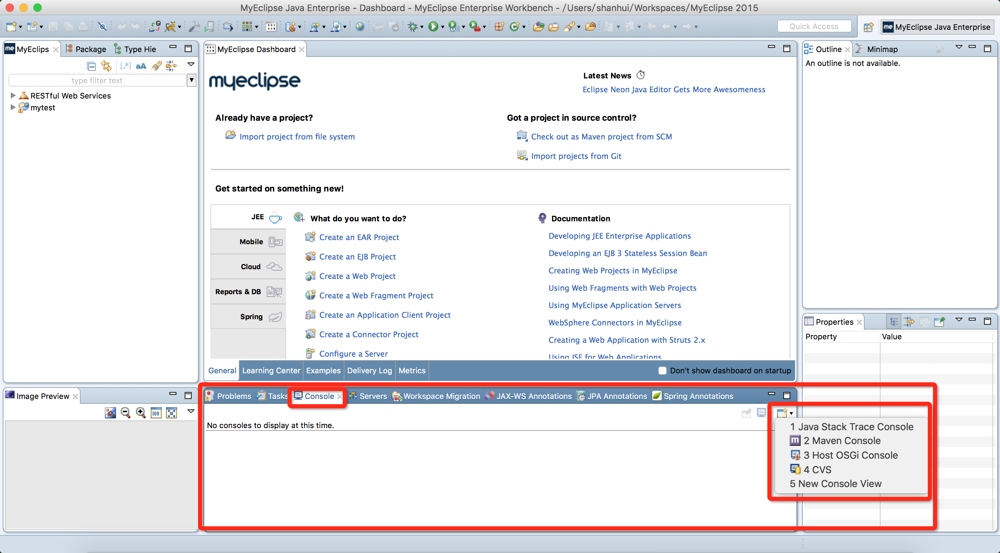

#准备开始

##1 页面

* 静态，例如说新闻页面
* 动态，例如说淘宝页面

##2 网络基本架构

* B/S

    * 优点：便于维护，实施

* C/S

    * 优点：界面更加丰富，更加安全，系统负载比较小

##3 开发工具

* MyEclipse
* Tomcat

##4 第一个页面

1. 打开MyEclipse
2. 创建Web Project工程，名字：myweb
3. 点击启动服务器
4. 点击部署服务器
5. 打开浏览器，输入地址访问页面，地址：

    ```
    http://localhost:8080/myweb/index.jsp
    ```
    
    URL构成

    ```[协议]://[主机名]:[端口]/[路径]/[文件]```

##5 可能存在的问题

###5.1 启动服务器时，没有打印输出log到控制台

选择控制台为__Java Stack Trace Console__即可。



###5.2 端口不能绑定，有两种方式

1. 第一种查看占用端口的进程，杀死进程
    打开控制台，输入以下代码：

    ``` sh
    # 查看端口占用
    netstat -ano | findstr 8080
    
    #TCP    0.0.0.0:8080    0.0.0.0:0   LISTENING   5984
    
    # 找到8080端口占用的进程名
    tasklist | findstr 5984
    
    #javaw.exe   5984    Console 0   17,972 K
    ```
    
    然后，进程管理器中找到对应的进程，杀死即可。
    
2. 修改Tomcat端口号

    MyEclipse中，点击Window -> Preferences -> MyEclipse Enterprise Workbench -> Servers -> Integrated Sandbox -> MyEclipse Tomcat 6 -> Port Number
        
###5.3 不能创建JSP文件 

开发视图使用MyEclipse视图，右上角，不要使用Java视图

###5.4 保存时候提示编码错误

添加__指令__，字符集为__GBK__

``` java
<%@ page contentType="text/html; charset=GBK" %>
```

##6 Html常见控件

* 文本框
* 复选框/单选框
* 下拉菜单
* 按钮
* 标签

__问题：__

* 如何把多个控件写成一个控件：name写成相同的即可。

---
__相关链接__

* [Html5标签参考](http://www.w3school.com.cn/tags/index.asp)

