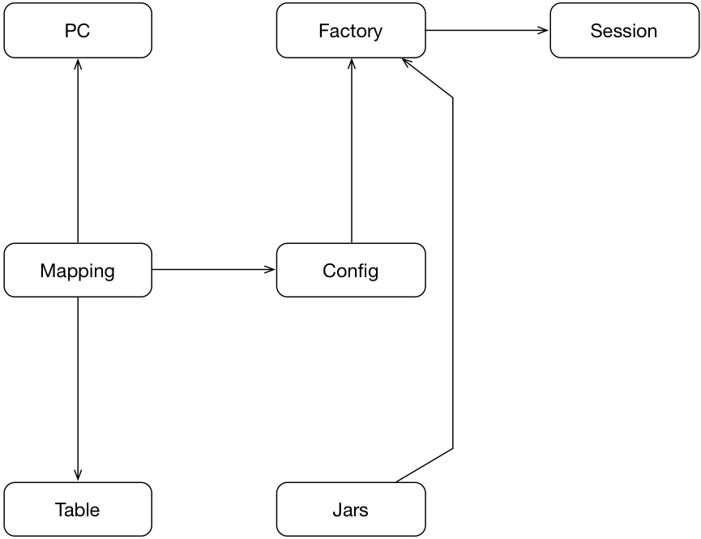
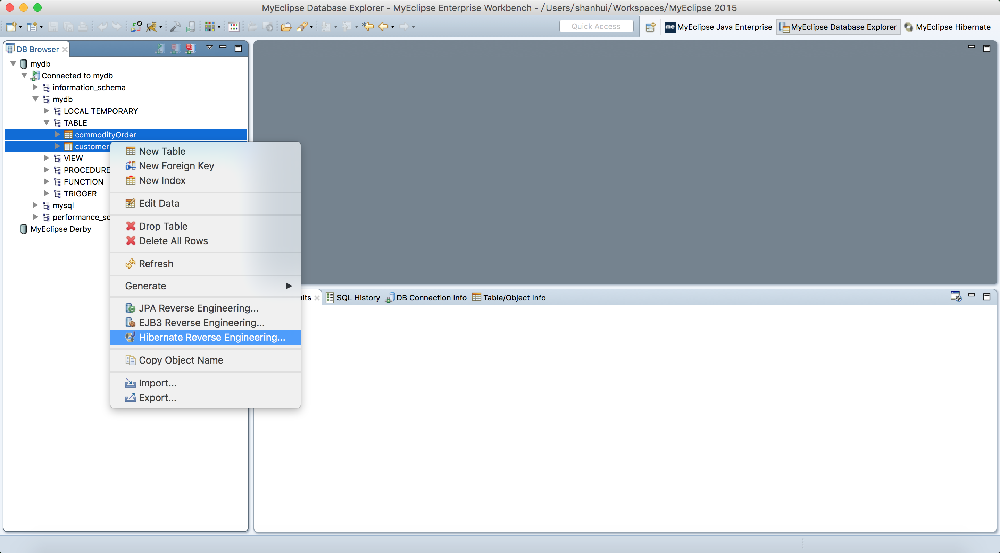
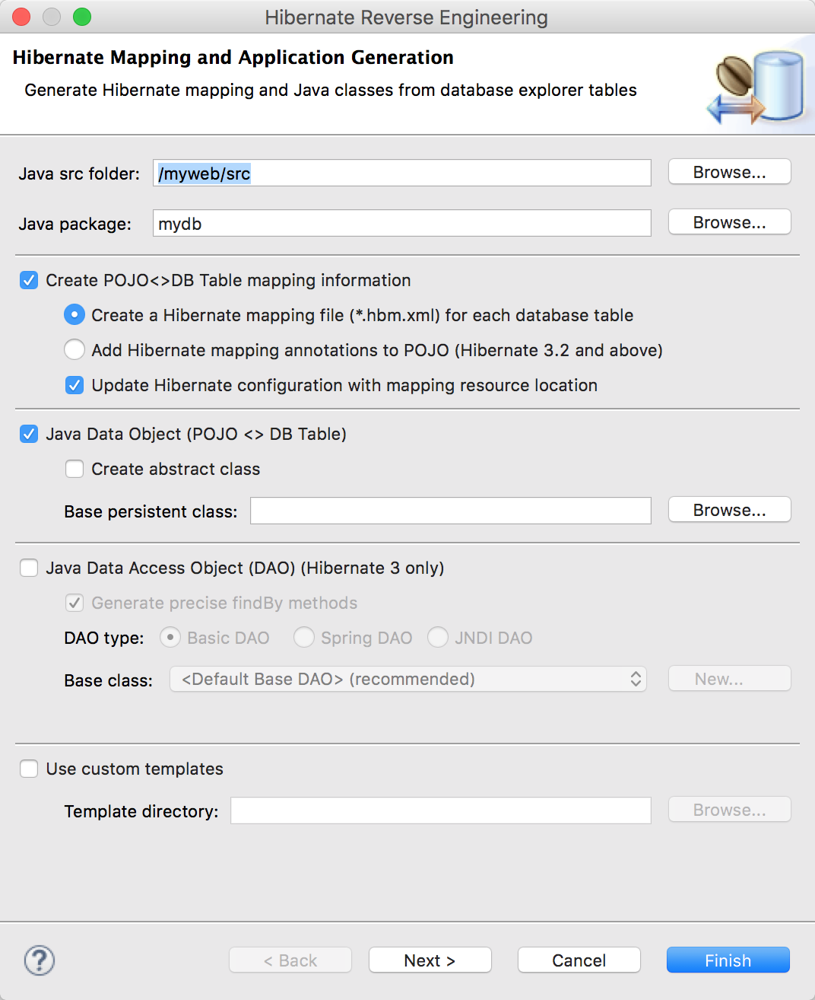
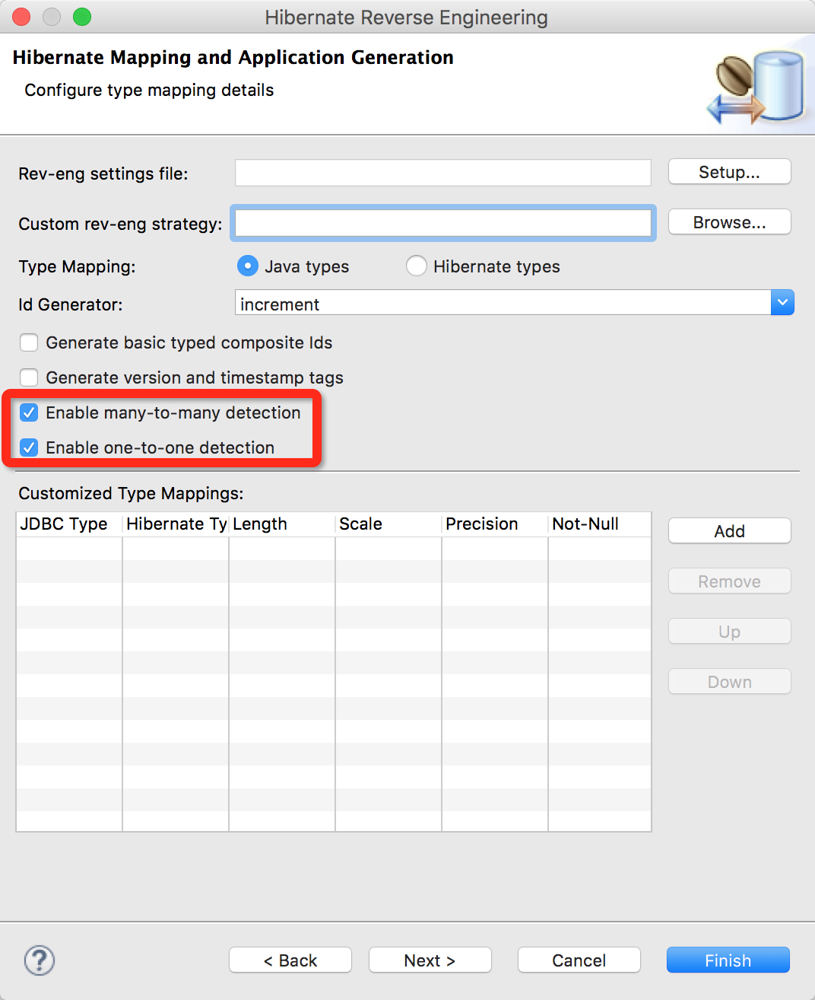
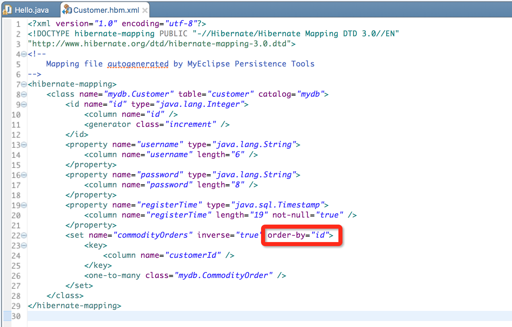

#Hibernate

Hibernate是一个对象关系映射ORM(Object Relational Mapping)框架，即数据与面对象的结构之间进行互相转化。Hibernate实现大致如下：



首先，根据数据库表，映射成持久化类PC（persistent class）；
其次，根据数据库等配置生成Session工厂，其中会加载对应的jar包，例如说mysql的驱动包等；
最后，通过Session工厂产生Session，并进行使用。

下面是一个简单的示例：

##1 建立数据库

``` sql
create database mydb;

use mydb;

create table customer(
   id int primary key,
   username varchar(6),
   password varchar(8),
   registerTime timestamp
)ENGINE = InnoDB;

insert into customer(id,username,password) values(1,'tom','pwa');
insert into customer(id,username,password) values(2,'jack','pwb');
insert into customer(id,username,password) values(3,'rose','pwc');
```

##2 MyEclipse中建立数据库连接

* 打开数据库视图

    ```Window -> Open Perspective -> MyEclipse Database Explorer```

    

* 新建数据库

    

* 配置数据库信息

    

##3 项目添加Hibernate功能

在Java视图下：

```Project右键 -> MyEclipse -> Add Hibernate Capabilities...```


选择刚才新建的数据库连接。


新建package：mydb

##4 通过表生成持久化和映射文件

* 切换到MyEclipse Hibernate Perspective视图
* 双击连接的数据库，并展开要映射的数据库中的表
* 右键要映射的表 -> Hibernate Reverse Engineering...


__注意选项__


__Id Generator: increment__

##5 客户端测试

完成以上步骤后，MyEclipse会自动生成以下几个文件：

* src/hibernate.cfg.xml
* src/mydb/Customer.java
* src/mydb/HibernateSessionFactory.java
* src/mydb/Customer.hbm.xml

其中，Customer是生成的持久化类PC（persistent class），类与表的对应关系依靠Customer.hbm.xml声明，主要内容如下：

* 类名 -> 表名
* 类属性 -> 表中列名
* 主键生成器 generator -> increment

在src/mydb中建立简单的测试程序：

``` java
package myhb;

//映射文件中not-null属性要改为false
import org.hibernate.*;

public class Hello {
	public static void main(String[] args) {		
		Customer c = new Customer();
		c.setUsername("aaa");
		c.setPassword("aaa");
		
		Session session = HibernateSessionFactory.getSession();
		Transaction ts = null;
		try {
			ts = session.beginTransaction();
			session.save(c);
			ts.commit();
			
		}catch (Exception e) {
			ts.rollback();
			System.out.println(e);
		} finally {
			HibernateSessionFactory.closeSession();
		}
	}
}
```

查看数据库，发现多了一条新的记录：

``` sql
mysql> select * from customer;
+----+----------+----------+---------------------+
| id | username | password | registerTime        |
+----+----------+----------+---------------------+
|  1 | tom      | pwa      | 2016-08-02 18:06:50 |
|  2 | jack     | pwb      | 2016-08-02 18:06:50 |
|  3 | rose     | pwc      | 2016-08-02 18:06:51 |
|  4 | aaa      | aaa      | 2016-08-02 18:15:16 |
+----+----------+----------+---------------------+
4 rows in set (0.00 sec)
```

##6 表间关联

1. 数据库中建立新的表格commodityOrder，与customer进行关联。

    ``` sql
    create table commodityOrder(
       id int primary key,
       orderNumber varchar(16),
       customerId int,
       foreign key(customerId) references customer(id)
    )ENGINE = InnoDB;
    
    insert into commodityOrder values(1,'tom01',1);
    insert into commodityOrder values(2,'tom02',1);
    insert into commodityOrder values(3,'tom03',1);
    insert into commodityOrder values(4,'jack01',2);
    insert into commodityOrder values(5,'jack02',2);
    insert into commodityOrder values(6,'rose01',3);
    insert into commodityOrder values(7,'rose02',3);
    insert into commodityOrder values(8,'rose03',3);
    ```

2. MyEclipse中删除原来的持久化类以及关系

    * 删除src/mydb/Customer.hbm.xml/>
    * 删除src/mydb/Customer.java
    * src/hibernate.cfg.xml中删除```<mapping resource="mydb/Customer.hbm.xml" />```

3. 建立新的持久化和持久文件
/>\n
    选中两个表，并右键，选择Hibernate Reverse Engineering...
    
     
    
    增加两个选项
    
4. 测试

    ``` java
    package myhb;

    import java.util.*;
    import org.hibernate.*;
    
    public class Hello {
        public static void main(String[] args) {
            
            Session session = HibernateSessionFactory.getSession();
            Transaction ts = null;
            try {
                ts = session.beginTransaction();
                    
                Customer c = (Customer)session.get(Customer.class, 1);
                Set<CommodityOrder> orders = c.getCommodityOrders();
                for (CommodityOrder order : orders) {
                    System.out.println(order.getOrderNumber());
                }
        
                ts.commit();
            }catch (Exception e) {
                ts.rollback();
                System.out.println(e);
            } finally {
                HibernateSessionFactory.closeSession();
            }
        }
    }
    ```
    
5. 排序问题
    
    查询出来的orders结果顺序默认按照Set的顺序存储，如果要进行排序的话，可以对src/mydb/Customer.hbm.xml进行修改。
    

##7 练习题

1. 注册登录
2. 商品查询，支持模糊查询
3. 会员增添与删除
