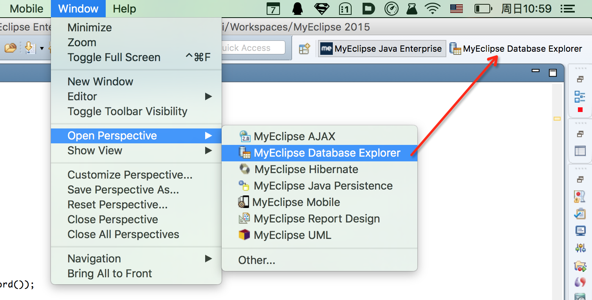
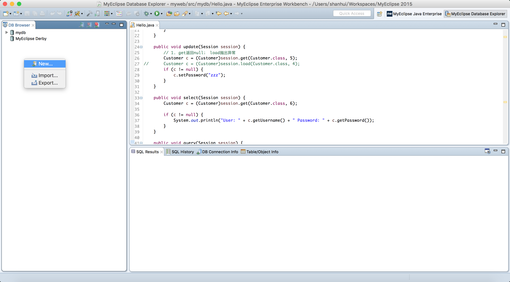
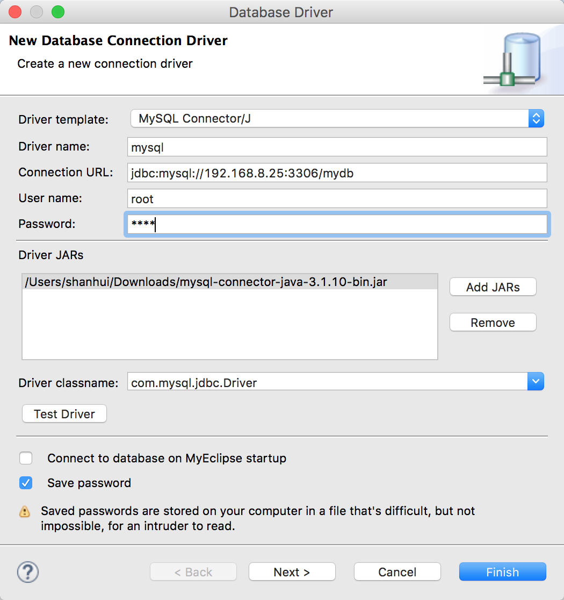
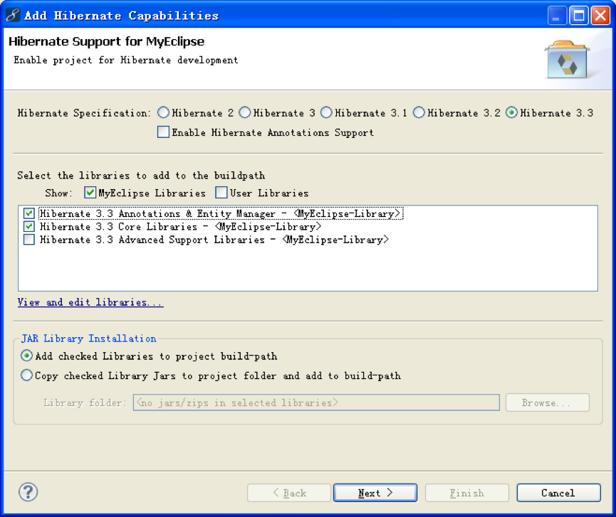
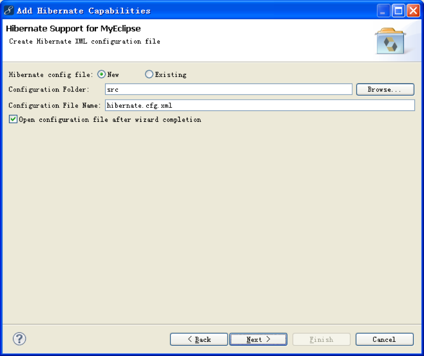
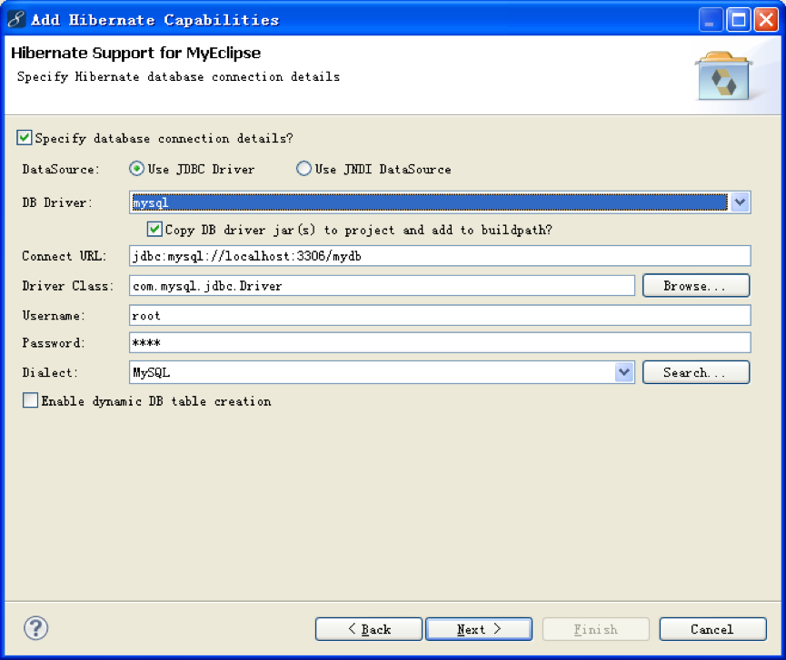
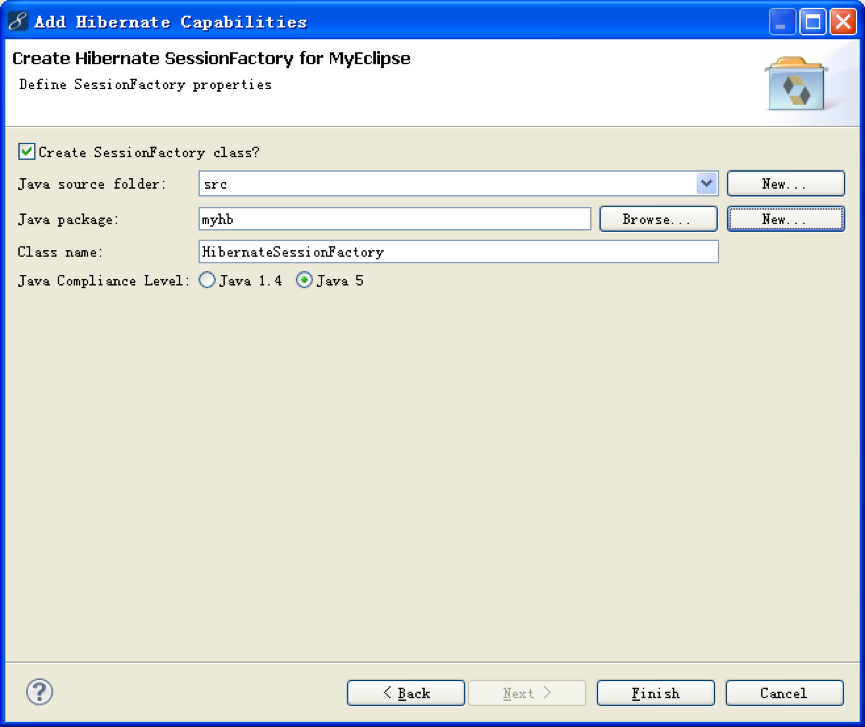
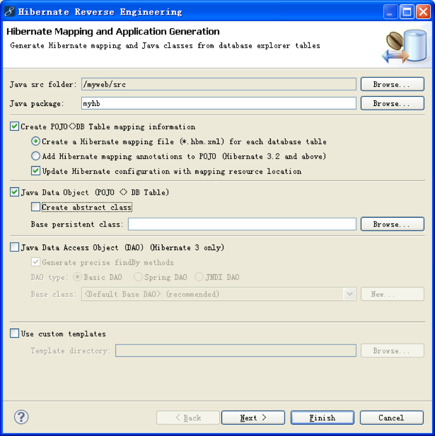
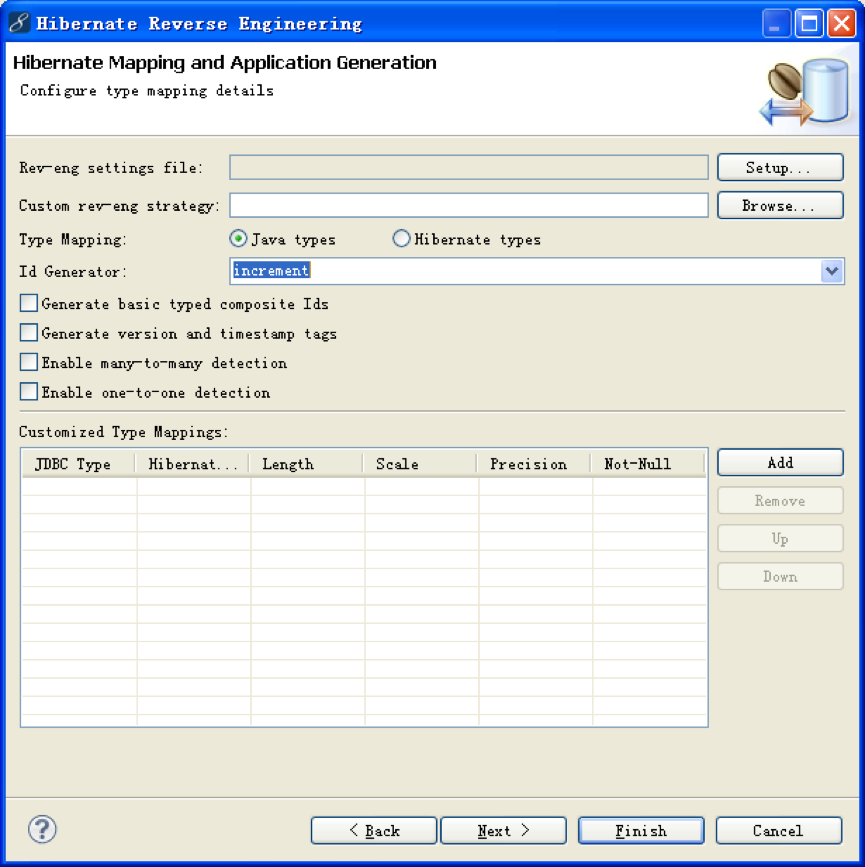

#Hibernate

Hibernate是一个对象关系映射ORM(Object Relational Mapping)框架，即数据与面对象的结构之间进行互相转化。下面是一个简单的示例：

##1. 建立数据库

``` sql
create database mydb;

use mydb;

create table customer(
   id int primary key,
   username varchar(6),
   password varchar(8),
   registerTime timestamp
)ENGINE = InnoDB;

insert into customer(id,username,password) values(1,'tom','pwa');
insert into customer(id,username,password) values(2,'jack','pwb');
insert into customer(id,username,password) values(3,'rose','pwc');
```

##2. MyEclipse中建立数据库连接

* 打开数据库视图

    ```Window -> Open Perspective -> MyEclipse Database Explorer```

    </img>

* 新建数据库

    </img>

* 配置数据库信息

    </img>

##3. 项目添加Hibernate功能

在Java视图下：

```Project右键 -> MyEclipse -> Add Hibernate Capabilities...```

</img>

</img>

</img>
选择刚才新建的数据库连接。

</img>
新建package：mydb

##4. 通过表生成持久化和映射文件

* 切换到MyEclipse Hibernate Perspective视图
* 双击连接的数据库，并展开要映射的数据库中的表
* 右键要映射的表 -> Hibernate Reverse Engineering...

</img>
__注意选项__

</img>
__Id Generator: increment__

##5. 客户端测试

完成以上步骤后，MyEclipse会自动生成以下几个文件：

* [x] src/hibernate.cfg.xml
* [x] src/mydb/Customer.java
* [x] src/mydb/HibernateSessionFactory.java
* [x] src/mydb/Customer.hbm.xml

其中，Customer是生成的持久化类PC（persistent class），类与表的对应关系依靠Customer.hbm.xml声明，主要内容如下：

* 类名 -> 表名
* 类属性 -> 表中列名
* 主键生成器 generator -> increment

在src/mydb中建立简单的测试程序：

``` java
package myhb;

//映射文件中not-null属性要改为false
import org.hibernate.*;

public class Hello {
	public static void main(String[] args) {		
		Customer c = new Customer();
		c.setUsername("aaa");
		c.setPassword("aaa");
		
		Session session = HibernateSessionFactory.getSession();
		Transaction ts = null;
		try {
			ts = session.beginTransaction();
			session.save(c);
			ts.commit();
			
		}catch (Exception e) {
			ts.rollback();
			System.out.println(e);
		} finally {
			HibernateSessionFactory.closeSession();
		}
	}
}
```

查看数据库，发现多了一条新的记录：

``` sql
mysql> select * from customer;
+----+----------+----------+---------------------+
| id | username | password | registerTime        |
+----+----------+----------+---------------------+
|  1 | tom      | pwa      | 2016-08-02 18:06:50 |
|  2 | jack     | pwb      | 2016-08-02 18:06:50 |
|  3 | rose     | pwc      | 2016-08-02 18:06:51 |
|  4 | aaa      | aaa      | 2016-08-02 18:15:16 |
+----+----------+----------+---------------------+
4 rows in set (0.00 sec)
```
