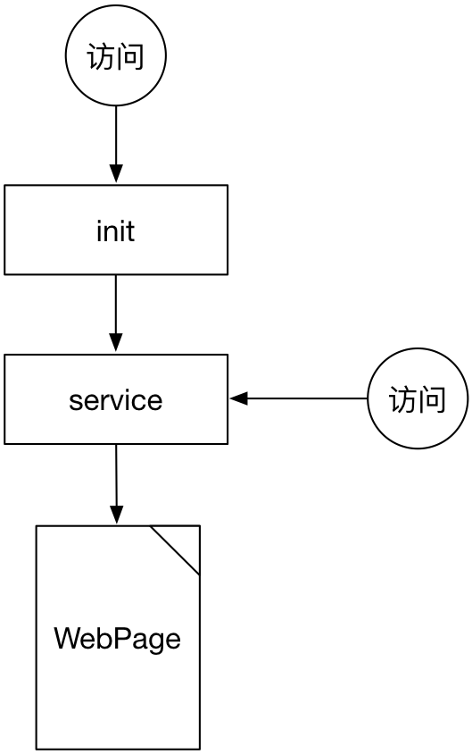

#Servlet

Servlet是一个Java类，运行结果是一个页面。JSP也是一个Servlet，是一种特殊的形式。

其流程是先进行init，然后调用service，生成一个页面。当下一次再次请求时，可以不用再去init，直接执行service，大幅度提高效率。



但是Servlet是有声明周期的，其声明周期主要是：

1. 内存不足；
2. 最后一次访问周期过长（参考值20分钟）；

**注意**

* Servlet清除之前需要先调用destroy。

##构成

Servlet是有以下几部分构成：

1. 一个Java类；
2. 一段配置信息；

##Java类

``` java
package myweb;

import javax.servlet.*;
import javax.servlet.http.*;
import java.io.*;

public class Servlet1 extends HttpServlet {

  public void init() throws ServletException {
  }

  public void service(HttpServletRequest request, HttpServletResponse response) throws ServletException, IOException {
    response.setContentType("text/html;charset=utf8");
    //response.setCharacterEncoding("GBK");
    PrintWriter out = response.getWriter();
    out.println("<html>");
    out.println("<head><title>Servlet1</title></head>");
    out.println("<body bgcolor=\"#ffffff\">");
    out.println("<p>上海</p>");
    out.println("</body></html>");
  }

  public void destroy() {
  }
}
```

一个Java类，分为 ```init```，```service```，```destroy``` 三部分：

* init：全局的声明部分；
* service：处理每次请求，一般可以分为get，post，put，delete四种，例如说在此调用 ```doGet```，```doPost``` 等；

##配置信息

配置信息位置在 ```WEB-INF/web.xml``` 中定义。

``` xml
<?xml version="1.0" encoding="UTF-8"?>
<web-app version="3.0"
    xmlns="http://java.sun.com/xml/ns/javaee"
    xmlns:xsi="http://www.w3.org/2001/XMLSchema-instance"
    xsi:schemaLocation="http://java.sun.com/xml/ns/javaee http://java.sun.com/xml/ns/javaee/web-app_3_0.xsd">
  <servlet>
    <servlet-name>MyServlet</servlet-name> 别名
    <servlet-class>myweb.MyServlet</servlet-class> 物理名
  </servlet>

  <servlet-mapping>
    <servlet-name>MyServlet</servlet-name>
    <url-pattern>/MyServlet</url-pattern> 访问名
  </servlet-mapping>

</web-app>
```

##JSP与Servlet

* 内置对象只在JSP中存在，其他地方不存在
* JSP是用HTML标签，然后添加代码控制逻辑。Servlet是用代码，然后嵌入HTML标签。
* JSP主要是用来服务用的，不是显示用的。

    * 最初：JSP + JavaBean
    * 后来：各自发挥各自的长处。JSP主要用来做基础，支撑前台技术，例如HTML，js等；Servlet主要用来写控制逻辑代码。(MVC模式)

* JSP通过表单超链接访问Servlet，并传递参数；Servlet通过代码跳转到JSP，通过request获取JSP传递过来的参数。
    * 跳转：response.sendRedirect("a.jsp");
    * 页面转向dispatcher.forward(request, response);这种可以将__参数传递下去__
    * 传递参数可以使用session继续传递(**重要**)
    * 获取Application: ServletContext ```ServletContext application = this.getServletContext()```

##web.xml

web.xml主要包含以下内容：

* servlet
* welcom-file-list
* context-param

##contex-param

``` xml
<context-param>
    <param-name>a</param-name>
    <param-value>zzz</param-value>
</context-param>
```

相当于

``` java
application.getInitParamter("a");
```
